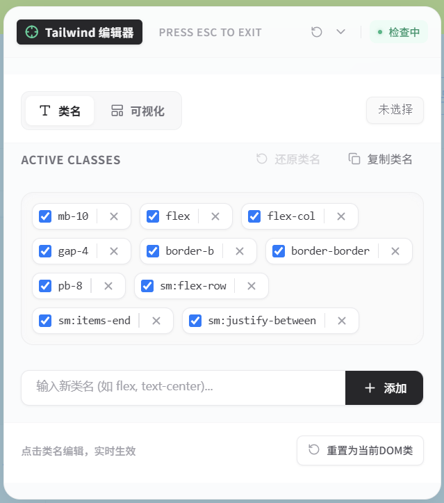
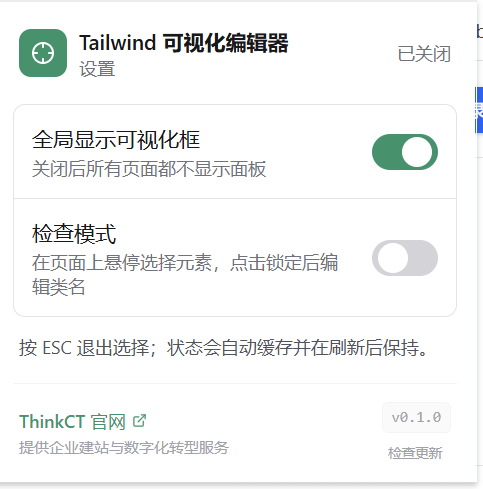

# Tailwind 可视化编辑器 (Tailwind Visual Editor)

> 一款基于 React + Tailwind CSS 的 Chrome / Edge 扩展（Manifest V3）：在任意网页上**悬停选中元素、实时增删改 Tailwind 类名**，并配合**可视化面板**一键切换布局与 Flexbox 样式，改动立即生效、即时预览。

   

---

## 🖼️ 界面预览

**在真实站点上悬停检查元素**：盒模型高亮（margin / padding / 内容区）+ 四条对齐辅助线 + 尺寸信息标签，右侧为可视化编辑面板。


| 类名编辑面板 | 扩展设置（Popup） |
| --- | --- |
|  |  |
| 类名标签化编辑：勾选启用 / 禁用、行内重命名、删除、复制与还原，支持 `sm:` 等断点前缀类名 | 全局显示开关与检查模式开关，开关状态跨标签页同步并持久化，底部为版本号与「检查更新」入口 |

---

## ✨ 核心功能

### 1. 元素检查模式（Inspect Mode）
- **悬停高亮**：像浏览器开发者工具一样，鼠标移动即高亮光标下的元素。
- **盒模型可视化**：绘制 margin（橙）/ padding（绿）/ 内容区（蓝）色块，并在元素上方显示信息标签：标签名、`宽 × 高`、`m:` / `p:` 数值。
- **对齐辅助线**：在视口内绘制上下左右四条虚线，方便排查对齐问题。
- **点击锁定 / 再次点击取消**：点击元素锁定为编辑目标；点击其他区域取消锁定，回到悬停选择。
- **滚动与缩放跟随**：监听 `scroll` / `resize`，高亮框与辅助线实时重算位置。
- **Esc 退出**：按下 `ESC` 关闭检查模式并清空选中状态。
- **不干扰页面**：通过坐标命中判断区分「事件是否发生在面板内」，检查期间页面光标切换为十字准星（`.tw-ve-grab`）。

### 2. 实时类名编辑（「类名」Tab）
- **类名标签化**：将元素 `class` 拆成一个个标签，支持点击**行内编辑**、勾选框**临时禁用 / 启用**（禁用项显示删除线且不写入 DOM）、**删除**、以及输入框**新增**（Enter 或「添加」按钮）。
- **实时预览**：每次变更立即写回 `element.className`，页面样式即时刷新。
- **还原 / 重置**：
  - 「还原类名」→ 回到**首次选中时**的类名快照；
  - 「重置为当前 DOM 类」→ 重新从 DOM 读取最新类名。
- **一键复制**：复制当前元素全部类名（优先 `navigator.clipboard`，失败自动降级到 `document.execCommand('copy')`），成功后按钮显示「已复制」。

### 3. 可视化编辑（「可视化」Tab）

用点选代替手写类名，同一分组内自动做**互斥替换**（保证只保留一个类名）：

| 分类 | 分组 | 可选值 |
| --- | --- | --- |
| 基础布局 | Display 显示 | `block`、`flex`、`grid`、`inline`、`inline-block`、`inline-flex`、`inline-grid`、`hidden` |
| 基础布局 | Visibility 可见性 | `visible`、`invisible`、`collapse` |
| Flexbox & Grid | Direction 方向 | `flex-row`、`flex-col`、`flex-row-reverse`、`flex-col-reverse`（附「启用 Flex」快捷按钮） |
| Flexbox & Grid | Wrap 换行 | `flex-nowrap`、`flex-wrap`、`flex-wrap-reverse` |
| Flexbox & Grid | Justify Content 主轴对齐 | `justify-normal/start/center/end/between/around/evenly/stretch` |
| Flexbox & Grid | Align Items 交叉轴对齐 | `items-start/center/end/baseline/stretch` |

- 已生效的选项会高亮；再次点击同一项即移除该类名。
- 面板底部提示「更多可视化配置项即将到来」，可按同样的分组模式继续扩展 Spacing、Sizing、Typography 等。

### 4. Tailwind 类名自动补全

`src/content/autocomplete.tsx` 内置轻量补全引擎（无需联网、零额外依赖）：
- **静态类名库**：布局、定位、层级、尺寸、Flex/Grid、间距、圆角、边框、阴影、文字与字体等常用类名。
- **按标尺动态生成**：输入 `p-`、`px-`、`m-`、`gap-`、`space-x-`、`w-`、`h-`、`min-w-`、`max-h-` 等前缀时，按 Tailwind 默认间距标尺生成候选（含 `px`）。
- **颜色体系**：输入 `text-`、`bg-`、`border-`、`ring-`、`from-`、`via-`、`to-` 时生成 `颜色 × 色阶` 候选（22 种颜色 × 11 档色阶）；`rounded-*` 与 `text-{size}` 另有专门候选。
- **交互**：`↑` / `↓` 选择、`Enter` 确认、`Esc` 关闭；前缀匹配优先于包含匹配，最多展示 12 条。

### 5. 弹窗总控与多标签页同步（Popup）
- **全局显示可视化框**：关闭后所有页面都不再显示面板。
- **检查模式开关**：控制是否进入「悬停选择元素」状态。
- 两者写入 `chrome.storage.local`，并通过 `chrome.storage.onChanged` **广播到所有已打开页面**，实现跨标签页状态同步；Service Worker 会为所有可注入标签页补注入 content script（自动跳过 `chrome://`、`edge://`、`chrome-extension://`、`about:`）。
- 面板的**拖拽位置**与**折叠状态**同样持久化并跨页面同步；提供「重置位置」按钮。

### 6. 版本展示与更新检查
- Popup 展示当前版本（读取 `package.json` 的 `version`）。
- 「检查更新」按钮内置 `x.y.z` 逐段版本号比较，发现新版本时展示提示与官网下载入口。
  > 当前是**演示实现**（模拟请求 + 固定返回 `0.2.0`）。接入真实更新源时，替换 `src/popup/main.tsx` 中 `checkUpdate` 里的模拟逻辑即可，文件内已留好 GitHub Releases API 的示例注释。

### 7. DevTools 面板（入口已就绪）
`src/panel.html` + `src/panel/main.tsx` 注册为 `devtools_page`，目前展示使用提示，作为后续 DevTools 深度集成（元素树、类名 diff 等）的占位入口。

---

## 🛠️ 技术栈

| 类别 | 选型 |
| --- | --- |
| UI | React 18（`react-dom/client` + `createRoot`） |
| 样式 | Tailwind CSS 3.4 + PostCSS + autoprefixer |
| 图标 | lucide-react |
| 构建 | Vite 5（popup / panel / background）+ esbuild（content script 打成 IIFE） |
| 语言 | TypeScript 5（`strict`） |
| 扩展规范 | Chrome Extension Manifest V3 |
| 类型 | `@types/chrome` |

**为什么 content script 单独用 esbuild 打包？** content script 需要以 IIFE 形式注入，不能携带 ESM `import`，因此由 `scripts/build-content.mjs` 打成单文件 `dist/assets/content.js`。

---

## 📁 目录结构

```
tailwind-visual-editor/
├─ manifest.json              # MV3 清单：权限、content_scripts、devtools_page
├─ vite.config.ts             # 多入口构建：popup / panel / background
├─ tailwind.config.cjs        # Tailwind 扫描范围 ./src/**/*.{ts,tsx,html}
├─ postcss.config.cjs
├─ tsconfig.json
├─ scripts/
│  ├─ build-content.mjs       # esbuild 打包 content script → dist/assets/content.js
│  └─ postbuild.mjs           # 拷贝 manifest、给 background.js 加版本 banner
└─ src/
   ├─ popup.html / panel.html # 两个 HTML 入口
   ├─ popup/main.tsx          # 扩展弹窗：全局开关、检查模式、版本与更新
   ├─ panel/main.tsx          # DevTools 面板（占位）
   ├─ background/index.ts     # Service Worker：注入、消息转发、存储变更广播
   ├─ content/
   │  ├─ main.tsx             # 核心：检查器 + 悬浮面板 + 高亮 Overlay（Shadow DOM 挂载）
   │  └─ autocomplete.tsx     # 类名补全引擎与 AutocompleteInput 组件
   ├─ styles/tailwind.css     # Tailwind 指令、十字准星光标、自定义滚动条
   └─ images/                 # README「界面预览」所用的三张截图
```

### 架构要点

- **Shadow DOM 隔离**：content script 把 React 面板挂载进 `#__tw_visual_editor__` 下的 Shadow Root，并从 `assets/tailwind.css` 注入样式，既能避免宿主页面样式污染面板，也不会污染宿主页面。
- **极高层级**：Overlay 使用 `z-[2147483646]`，主面板使用 `z-[2147483647]`，确保始终浮在页面最上层。
- **消息协议**：`TW_TOGGLE`（切换检查模式）、`TW_GET_ENABLED`（查询状态）、`TW_TOGGLE_ACTIVE`（切换当前激活标签页）。监听器在 content script 顶层注册并设置全局标记，避免 React 未挂载或重复注入时丢消息。
- **存储键**：`tw_ve_global_enabled`、`tw_ve_inspect_enabled`、`tw_ve_panel_pos`、`tw_ve_panel_collapsed`。

---

## 🚀 编译与安装

### 环境要求
- Node.js ≥ 18
- Chrome / Edge（支持 Manifest V3）

### 1. 安装依赖
```bash
npm install
```

### 2. 开发模式（Vite 监听）
```bash
npm run dev
```

### 3. 生产构建
```bash
npm run build
```

`build` 依次执行三步：
1. `vite build` → 输出 `dist/`（`popup.html`、`panel.html`、`assets/background.js`、`assets/tailwind.css` 等）；
2. `node scripts/build-content.mjs` → 生成 `dist/assets/content.js`；
3. `node scripts/postbuild.mjs` → 拷贝 `manifest.json` 到 `dist/`，并给 `background.js` 加上版本 banner。

> ⚠️ `npm run dev` 只启动 Vite 开发服务器，**不会**产出 `dist/assets/content.js`。要在浏览器里调试完整功能，请使用 `npm run build`（或另行执行 `node scripts/build-content.mjs`）。

### 4. 类型检查
```bash
npm run typecheck
```

### 5. 在浏览器中加载插件
1. 打开扩展程序页面：Chrome 输入 `chrome://extensions/`，Edge 输入 `edge://extensions/`；
2. 开启右上角的 **开发者模式**；
3. 点击 **加载已解压的扩展程序**；
4. 选择本项目构建后生成的 `dist` 文件夹；
5. 修改代码后重新构建，并在扩展页点击「刷新」按钮使其生效。

---

## 💡 使用说明

1. **启用插件**：点击浏览器工具栏的扩展图标打开设置面板，确认 **「全局显示可视化框」** 与 **「检查模式」** 均已开启。
2. **检查元素**：在网页上移动鼠标，插件自动高亮悬停元素，并显示盒模型与尺寸信息。
3. **锁定并编辑**：点击目标元素，选中框被锁定，页面右下角出现 Tailwind 可视化编辑面板（可拖拽、可折叠）。
4. **调整样式**：
   - **「类名」Tab**：编辑标签、临时禁用、新增或删除类名，页面样式实时更新；
   - **「可视化」Tab**：点选 Display / Visibility / Flexbox 等样式，同组类名自动互斥替换。
5. **复制与退出**：调试满意后点击「复制类名」获取最终类名，粘回源码；按 `ESC` 取消选中并恢复悬浮检查模式。

---

## ⚠️ 注意事项与已知限制

- **只改运行时 DOM**：编辑结果不会写回项目源码，需要手动复制类名回代码。
- **权限较宽**：清单声明了 `<all_urls>` 主机权限与 `activeTab`、`scripting`、`storage`、`tabs` 权限，才能在任意页面注入面板；如需上架商店，建议补充用途说明或改用 `optional_host_permissions` 按需申请。
- **整体覆写 `className`**：应用类名时会替换 `element.className`，对使用 CSS-in-JS 或频繁自更新的框架组件，改动可能被其重渲染覆盖。
- **无法编辑页面自身 Shadow DOM 内的元素**：`document.elementFromPoint` 无法穿透宿主页面的 Shadow Root（扩展自身面板已通过坐标判断排除）。
- **依赖页面已有 Tailwind**：可视化编辑只是写入类名，若页面未加载 Tailwind（或等效工具类样式），改动不会有可见效果。
- **更新检查为模拟实现**：见上文「版本展示与更新检查」。
- **DevTools 面板尚未实现功能**：目前仅为占位页。

---

## 🗺️ 后续计划

- 补齐可视化分组：Spacing（内外边距）、Sizing、Typography、Border、Effects 等；
- 支持响应式断点前缀（`sm:` / `md:` / `lg:`）与状态前缀（`hover:` / `focus:`）；
- 类名变更历史、diff 与撤销 / 重做；
- DevTools 面板接入元素树与更完整的样式检查；
- 接入真实版本更新接口与自动化构建发布流程。

---

## 🔗 相关链接

- 官网：[https://www.thinkct.net/](https://www.thinkct.net/)（提供企业建站与数字化转型服务）
- 参考文档：[Tailwind CSS](https://tailwindcss.com/docs) · [Chrome Extensions MV3](https://developer.chrome.com/docs/extensions/develop/migrate/what-is-mv3) · [Vite](https://vitejs.dev/) · [lucide-react](https://lucide.dev/)

---

## 📦 发布与命名

项目统一使用 **`tailwind-visual-editor`** 作为仓库名 / 包名，扩展显示名保持 **「Tailwind 可视化编辑器」**。
发布到 GitHub 前请完成以下事项：

- [ ] 把 `manifest.json` 里的 `homepage_url` 从 `TODO-your-github-username` 改成你的真实仓库地址；
- [ ] 补一份 `LICENSE`（如 MIT），并同步填写 `manifest.json` 的 `author` 字段；
- [ ] 截图已接入 README 顶部的「界面预览」，但文件名 `src/images/1.png`、`22.png`、`33.png` 含义不明，建议重命名为语义化文件名（如 `inspector-overlay.png`、`class-editor-panel.png`、`popup-settings.png`）并同步更新 README 中的引用路径；
- [ ] 提供英文 README（`README.en.md`）或中英对照，便于海外用户检索；
- [ ] 上架 Chrome Web Store 时，标题建议补充差异化描述，例如
      **「Tailwind Visual Editor — Inspect & Tweak Classes」**，因为商店内已有 Tifoo、Gimli Tailwind、Tail Lens、Tailwind Inspector 等同类扩展；
- [ ] 如需让用户长期跟踪更新，补充 `CHANGELOG.md` 与 GitHub Releases，并把 Popup 里 `checkUpdate` 的模拟逻辑替换为真实接口。

---

## 📄 许可

仓库当前未附带许可证文件。如需开源分发，建议补充 MIT / Apache-2.0 等许可证声明。
